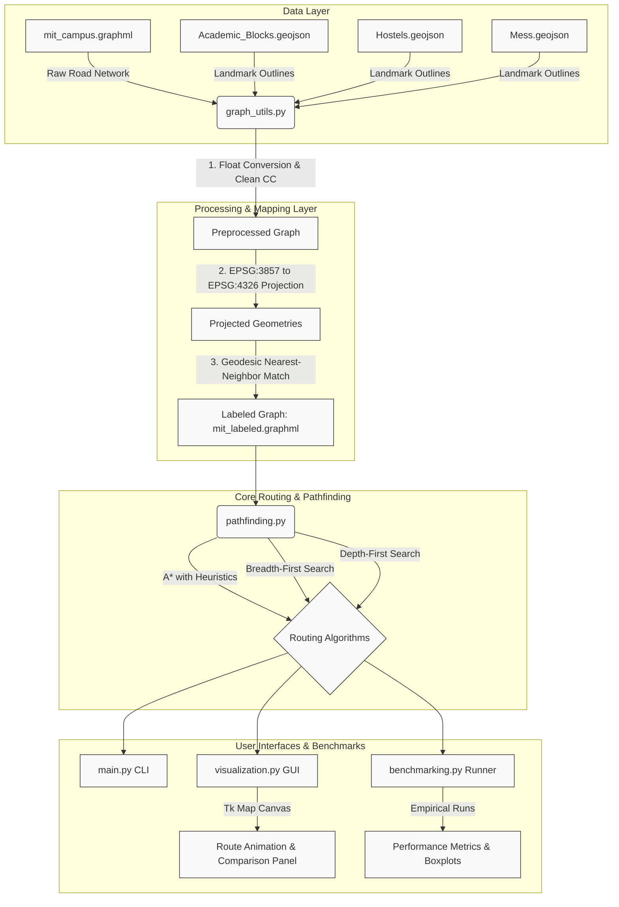

# A* Campus Route Planner

A campus navigation and route planning system designed for the **Manipal Institute of Technology (MIT) Campus**. This system merges landmark mapping, routing algorithms (A*, BFS, DFS), an interactive Tk-based GUI map interface, and an empirical benchmarking engine into a modular Python application.


## System Components Architecture

The diagram below shows the high-level data flow and component interactions from raw files to final visualizations.




## Project Structure


```
Astar-Campus-Route-Planning/
│
├── data/                                 # Spatial datasets & output assets
│   ├── Academic_Blocks.geojson           # GeoJSON boundaries for classrooms/blocks
│   ├── Hostels.geojson                   # GeoJSON points/polygons for hostels
│   ├── Mess.geojson                      # GeoJSON footprints for dining halls
│   ├── mit_campus.graphml                # Raw graph representing roads & intersections
│   ├── mit_labeled.graphml               # Pre-processed graph with matched landmark labels
│   └── labeled_map.png                   # PNG render of the road network & landmark locations
│
├── src/                                  # Modular source package
│   ├── __init__.py                       # Package initializer
│   ├── config.py                         # File paths, projections, and simulation settings
│   ├── graph_utils.py                    # Graph loading, cleaning, and nearest-neighbor label matching
│   ├── pathfinding.py                    # A*, BFS, and DFS routing implementations
│   ├── visualization.py                  # Matplotlib GUI, step-by-step route animations, and comparisons
│   └── benchmarking.py                   # Performance metrics collector and comparative plotting
│
├── main.py                               # Unified Command Line Interface
├── requirements.txt                      # Project package dependencies
├── path_length_comparison.png            # Automatically generated benchmarking chart
└── README.md                             # Production documentation (this file)
```


## Installation & Setup

1. **Clone the repository** and navigate to the project directory:
   ```bash
   git clone https://github.com/guthlb/Astar-Campus-Route-Planning.git
   cd Astar-Campus-Route-Planning
   ```

2. **Create and activate a virtual environment**:
   ```bash
   python3 -m venv venv
   source venv/bin/activate
   ```

3. **Install the dependencies**:
   ```bash
   pip install -r requirements.txt
   ```

   *Note: On Linux, ensure `python3-tk` is installed on your system if you intend to run the interactive GUI:*
   ```bash
   sudo apt-get install python3-tk
   ```


## Usage Guide

The unified CLI entrypoint `main.py` provides four core subcommands.

### 1. Label the Graph (`label`)
Runs the coordinate conversion and nearest-neighbor matching pipeline to label raw graph nodes with real landmarks from GeoJSON data. Saves the processed graph and generates a labeled map image.
```bash
python main.py label
```

### 2. Find a Route Programmatically (`route`)
Computes the path between two landmarks (e.g. `'B 1'` hostel and `'Library'`).
- `--start`: Name of start landmark (case-insensitive) or raw node ID.
- `--goal`: Name of goal landmark or raw node ID.
- `--algo`: Pathfinding algorithm (`astar`, `bfs`, or `dfs`).
- `--traffic`: If added, runs A* with congested traffic simulation (inflates edge weights randomly).
- `--animate`: If added, displays a step-by-step GUI animation of the route traversal.
```bash
python main.py route --start "B 1" --goal "Library" --algo astar --animate
```

### 3. Launch Interactive Map GUI (`interactive`)
Opens an interactive window of the campus map:
- **Click 1**: Set Start node (marked in Green).
- **Click 2**: Set Goal node (marked in Red).
- Once selected, the system calculates and compares the A*, BFS, and DFS paths, runs a step-by-step navigation animation, and saves a 3-panel comparison chart (`algorithm_comparison.png`).
```bash
python main.py interactive
```

### 4. Run Empirical Benchmarks (`benchmark`)
Evaluates and benchmarks the execution speed, total distance (cost), and path node length of the three pathfinding algorithms over multiple randomized trials. Saves a 2x2 performance dashboard as `path_length_comparison.png`.
- `--runs`: The number of random route simulations to run (default: 50).
```bash
python main.py benchmark --runs 50
```

---

## Empirical Pathfinding Analysis

When executing `python main.py benchmark --runs 50`, the system logs and plots average performance metrics across the pathfinding algorithms:

| Metric | A* Algorithm | BFS Algorithm | DFS Algorithm |
| :--- | :--- | :--- | :--- |
| **Path Optimality** | **Optimal** (Weighted Shortest Path) | **Suboptimal** (Unweighted hop-count) | **Highly Suboptimal** (Randomized walkthrough) |
| **Average Time (ms)** | ~0.19 ms | **~0.04 ms** (Fastest) | ~0.08 ms |
| **Avg Path Cost (m)** | **~747 m** (Shortest) | ~811 m | ~2,050 m |
| **Avg Path Length (Nodes)** | ~10 nodes | ~9 nodes | ~24 nodes |
| **Success Rate (%)** | 100% | 100% | 100% |

### Key Takeaways
1. **A\* (Weighted)**: Provides the **optimal physical route** (averaging ~747 meters). While it performs more computation by calculating geodesic heuristics and edge lengths (taking ~0.19 ms), it guarantees the shortest walk.
2. **BFS (Unweighted)**: Computes the route with the **fewest intersection nodes/hops** (averaging ~9 nodes). Because it disregards actual road distances, it runs extremely fast (~0.04 ms) but leads to a longer walk (averaging ~811 meters).
3. **DFS (Randomized)**: Traverses the road network by following deep branches. While it eventually reaches the goal, it results in extremely long, winding loops (averaging ~2,050 meters, a **2.7x increase** in distance) and has high variance.
